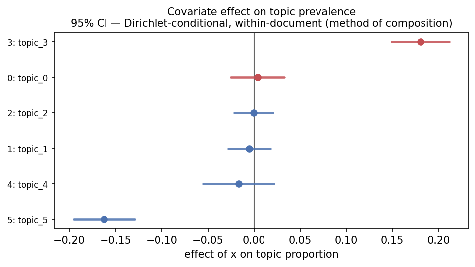

# Visualization

`topica.viz` is a manuscript-first visualization toolkit: an honest successor to
pyLDAvis that works across model families, exports the numbers behind every
figure, and refuses to draw what it cannot justify.

```python
import topica.viz as viz

viz.coherence_frontier(model, texts).to_png("quality.png")
viz.effect_plot(model, corpus, formula="~ year", data=meta).to_png("effects.pdf")
viz.term_barchart(model, topic=3, mode="frex").to_frame()
```

Every **static** view is a **panel** with three renderers:

- `.to_frame()` — a pandas DataFrame of the numbers behind the picture. Always
  available; this is your reproducibility and reviewer-armor.
- `.to_png(path)` — a matplotlib figure (PNG / PDF / SVG by extension). The
  publication renderer.
- `.to_html(path)` — an interactive (Plotly) build, for the few views interaction
  genuinely helps. Needs the `topica[viz]` extra.

A few views are interactive-only composites (for example `term_topic_browser`,
the linked topic/term dashboard) and expose just `.to_html(path)`; the static and
data renderers for that content live in the standalone `topic_similarity` and
`term_barchart` panels.

Install the toolkit with `pip install topica[viz]` (matplotlib, pandas, scipy,
and plotly for the interactive `.to_html()` builds), or `pip install topica[all]`
for everything.

## Honest by capability

The panels read a per-model **capability descriptor** (`viz.capabilities(model)`)
and switch their statistics and labels on it, so they never overclaim:

- A **c-TF-IDF** `topic_word` (BERTopic / Top2Vec) is not a probability, so the
  FREX / lift / relevance modes are disabled and the bars are labeled "c-TF-IDF
  weight," not "P(w | topic)."
- An **effect-plot confidence interval** is drawn only where a θ posterior exists.
  For an embedding/cluster model the panel shows point estimates and says so; pass
  `method="bootstrap"` for intervals. A topic the bootstrap flags as unreliable is
  drawn as a ghosted point, not a band.
- The uncertainty is **labeled for what it is** — a Gibbs model's
  Dirichlet-conditional (within-document) uncertainty is not a logistic-normal
  posterior.

## The covariate effect plot

The results figure for an STM paper: each topic's prevalence response to a
covariate, with method-of-composition intervals, diverging color centered at zero.

```python
ep = viz.effect_plot(model, corpus, formula="~ party", data=meta, nsims=50)
ep.to_png("effects.pdf")   # publication figure
ep.to_frame()              # coef / se / ci / reliable per topic
```



## Choosing K

Reuse `search_k` / `quality_frontier`, with the data export and a clean figure:

```python
rows = topica.search_k(docs, ks=[10, 20, 30, 40], held_out=test_docs)
viz.search_k(rows).to_png("choose_k.png")          # coherence / exclusivity / perplexity vs K
viz.coherence_frontier(model, texts).to_png("frontier.png")   # per-topic, defend dropping topics
```

## The pyLDAvis replacement: terms + a seriated similarity heatmap

Instead of a spurious 2-D "intertopic map," topica shows the K×K topic-similarity
matrix at full fidelity, ordered by hierarchical clustering (√Jensen-Shannon for
probability topics, cosine for c-TF-IDF), paired with a term barchart:

```python
viz.topic_similarity(model).to_png("similarity.png")
viz.term_barchart(model, topic=3, mode="frex", error_bars=True).to_png("terms.png")

# interactive: the seriated heatmap for the overview, a dropdown to read a topic's words
viz.term_topic_browser(model).to_html("explore.html")
```

`error_bars=True` adds top-word inclusion-probability bars (a bootstrap, so it is
off by default).

## Topic health: dead and duplicate topics

Two failure modes the headline table hides — topics with near-zero mass, and pairs
of topics whose word distributions are near-identical. Both are routine (HDP returns
many near-zero-mass topics by construction) and both are things a reviewer expects
you to have checked:

```python
h = viz.topic_health(model, min_mass_frac=0.01, dup_threshold=0.9)
h.to_png("health.png")    # mass-share bars, dead and duplicate flagged
h.to_frame()              # mass / hard_count / nearest_topic / nearest_cosine / flag
h.duplicates()            # [(a, b, cosine), ...] near-duplicate pairs
```

## Prevalence across groups and over time

A groups × topics heatmap, and per-topic prevalence trajectories as small multiples
(the readable replacement for a streamgraph). Pass `corpus=` and `nsims=` to widen
the estimates by the method of composition:

```python
viz.prevalence_heatmap(model, groups=meta["region"]).to_png("by_region.png")

viz.topics_over_time(model, timestamps=meta["year"]).to_png("over_time.png")
# CI ribbons (method of composition), Gibbs models need the corpus for theta draws
viz.topics_over_time(model, meta["year"], corpus=corpus, nsims=50).to_png("over_time_ci.png")
```

## Topic correlation, honestly

Raw across-document θ correlation is compositionally biased: the sum-to-one
constraint forces a spurious negative correlation (about −1/(K−1) even under
independence). `topic_correlation` offers the closure-corrected alternatives,
drawn as a zero-centered diverging heatmap:

```python
viz.topic_correlation(model, method="clr").to_png("corr.png")       # default, closure-corrected
viz.topic_correlation(model, method="partial").to_png("partial.png")  # others held fixed
viz.topic_correlation(model, method="eta").to_png("eta.png")        # CTM/STM logistic-normal Σ
viz.topic_correlation(model, method="raw")    # the biased estimate, labeled as such
```

It is refused for hard/degenerate-θ cluster models, where topic correlation is not
meaningful — use the topic-similarity heatmap there instead.

## The document map

A 2-D projection of the *document* cloud (a supplement figure), to see whether the
documents separate the way the topics claim. The projection runs in topica's own
Rust core — there is no Python UMAP/sklearn dependency:

```python
# count / soft-theta model: projects the clr-transformed theta simplex
viz.document_map(model, method="pca").to_png("map.png")

# embedding model: pass the doc embeddings you fit with (models do not retain them)
viz.document_map(bertopic, doc_embeddings=emb, method="umap").to_png("map.png")

# interactive WebGL scatter (Plotly), colored by dominant topic
viz.document_map(model, doc_embeddings=emb).to_html("map.html")
```

The same projection is available as a standalone primitive, `topica.project`:

```python
xy = topica.project(embeddings, n_components=2, method="pca")   # or "umap" / "tsne"
```

`method="pca"` (default) is deterministic and distance-faithful; the title reports
the fraction of variance the two axes carry. `method="umap"` and `method="tsne"`
preserve local neighborhoods but distort global geometry (between-cluster distances
and cluster sizes are not meaningful) and are not reproducible across runs — the
panel says so and displays the seed, and `project` warns. Density is shown with
alpha clouds / hexbin, never convex hulls. Past eight topics the default grays
everything; pass `highlight_topic=` to color one. Large corpora are
stratified-subsampled (by dominant topic, including `-1`) with a "showing N of D"
badge. A hard-θ cluster model with no embeddings is refused.

## The document inspector

Read one document the way the model read it: its θ mixture, its words shaded by the
topic each is most attributed to (`argmax_t p(t | w, d)`, computed from θ and φ), and
the documents most associated with its dominant topic:

```python
di = viz.document_inspector(model, texts, doc=12)
di.to_png("doc12.png")
di.to_frame()     # per-token: word / in_vocab / dominant_topic / p_topic
di.theta          # the document's topic proportions
di.neighbors      # find_thoughts for the dominant topic
```

It is refused for hard/degenerate-θ cluster models, where a per-token mixed-
membership attribution is not meaningful.

## Content covariate: how a topic is worded by group

For an STM or SAGE **content** model, the same topic is phrased differently across a
document covariate (party, decade, outlet). Rather than collapse to a reference
snapshot, this panel shows `p(w | topic, group)` for the union of each group's top
words as a words × groups heatmap:

```python
cc = viz.content_covariate(stm_or_sage, topic=3, n=10)
cc.to_png("topic3_by_group.png")
cc.to_frame()                       # group / word / prob / in_group_top
cc.matrix()                         # words × groups wide table
cc.contrast(model, "dem", "rep")    # words most distinguishing the two groups
```

It is refused for a model fit without a content covariate (a prevalence-only STM, or
any non-content model).

## One-call report

`dashboard()` introspects the descriptor and your arguments to assemble the
applicable panels:

```python
report = viz.dashboard(model, texts, corpus=corpus, formula="~ year", data=meta,
                       groups=meta["region"], timestamps=meta["year"])
report.to_html("report.html")    # interactive browser + static panels, self-contained
report.to_png("report.png")      # the static panels stacked
report.to_frame()                # {panel_name: DataFrame}
```

The topic-similarity heatmap, term barchart, and topic-health panels are always
included; the coherence frontier (with `texts`), effect plot (with a design), group
heatmap (with `groups`), time small-multiples (with `timestamps`), and the honest
correlation layer (for soft-θ models) are added by introspecting what you pass.
